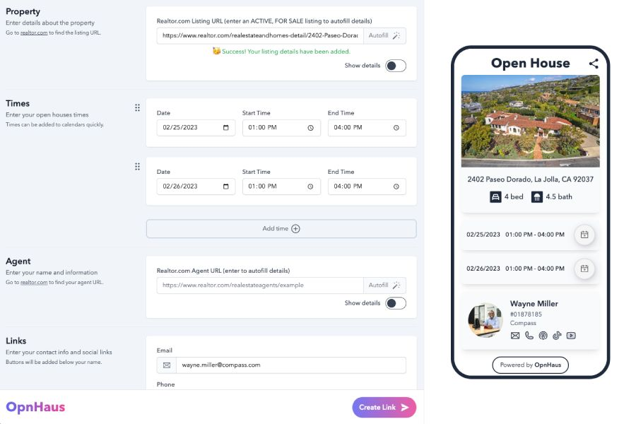

# OpnHaus

OpnHaus is an app for real estate agents to create beautiful landing pages for their open houses.



## Technology

- TypeScript - strongly typed programming language
- ReactJS - user interface library
- NextJS - React framework for production
- Tailwind CSS - CSS framework
- Cheerio - library for parsing and manipulating HTML and XML
- MongoDB Atlas - Cloud database and data services
- Vercel - platform for deploying and hosting

## Setup Locally

Make sure to install the dependencies:

```
yarn install
```

## Development Server

Start the development server on http://localhost:3000

```
yarn dev
```

## Production

Build the application for production:

```
yarn build
```

Locally preview production build:

```
yarn preview
```

## Template Credit

This app used [Onelink by fayazara](https://github.com/fayazara/onelink) as a starting point.
